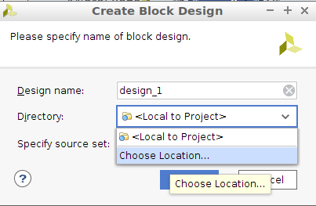
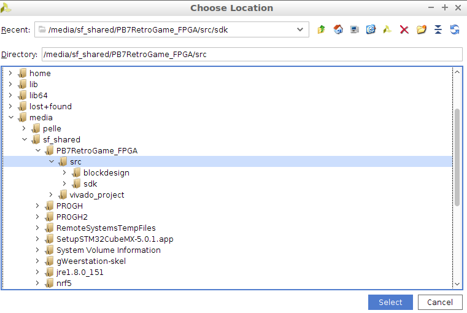

# Setting up the dev environment

### Software
- Install Xilinx Vivado 2017.4 (with SDK)
- Install [vivado-git](https://github.com/barbedo/vivado-git/tree/9de957f0c10c824dc80bb64b7e5a97df8c6e9e3e)
**be sure to use version/commit: `9de957f0c` for 2017.4 support**

### Workflow
##### Importing the project
In vivado:  
`Tools -> Run Tcl Script...`  
Choose `PB7_retrogame_fpga.tcl`

##### Adding source files
Source structure is as described in [vivado-git - workflow](https://github.com/barbedo/vivado-git/blob/9de957f0c10c824dc80bb64b7e5a97df8c6e9e3e/README.md#workflow)  
Do not add them *local to project* but to `src/` instead  

  
  

##### commiting changes
As described in [vivado-git - workflow](https://github.com/barbedo/vivado-git/blob/9de957f0c10c824dc80bb64b7e5a97df8c6e9e3e/README.md#workflow)  
typical simple commit:
in Tcl console (in vivado):
```
$ git add src  
$ git commit -m "My commit message"
```
*It is important to do this in the Tcl console as it automatically regenerates and commits the project tcl.*
